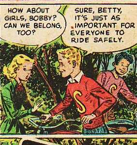
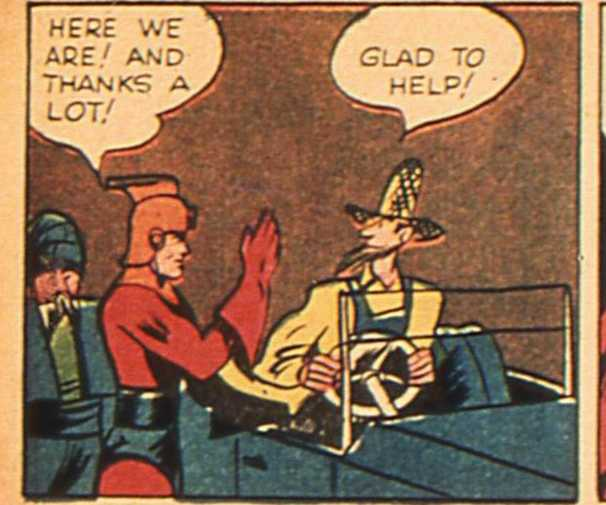
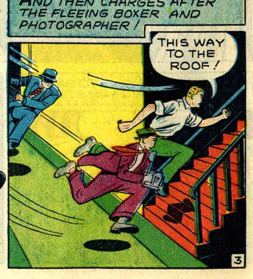

# Multimodal-Emotion-Recognition-on-Comics-scenes-EmoRecCom-
ICDAR2021 Competition hosted on Codalab. 
The emotions of comic characters are described by the Visual information, the Text in speech Balloons or Captions and the Onomatopoeia (Comic drawings of words that phonetically imitates, resembles, or suggests the sound that it describes). The task hence is a multi-modal analysis task which can take advantages from both fields: computer vision and natural language processing which are two of the main interests of the ICDAR community.

Link to the competition: 
https://competitions.codalab.org/competitions/27884

Dataset link:
https://drive.google.com/file/d/12fXFXw8AgxlZ7fU4_kcPogN2YDdT5rK3/view

Training/Testing Data (6,112/2046)

Data format:
train_transcriptions.json: contains auto-transcriptions in comic scenes

train: contains raw images of training data

train_emotion_labels.csv: contains binary labels
additional_infor:emotion_polarity.csv: contains additional info, the polarities of emotions in (0,1). Participants are encouraged to leverage these additional resources to achieve better performance.

test: contains raw images of testing data

test_transcriptions.json: contains auto-transcriptions in comic scenes

Target labels:
There are 8 emotion classes including: 0=Angry, 1=Disgust, 2=Fear, 3=Happy, 4=Sad, 5=Surprise, 6=Neutral, 7=Others.

Sample Predictions:

Example 1:

 **Prediction: [Happy, Surprise, Neutral] | Ground Truth: [Happy, Surprise, Neutral]**

Example 2:

 **Prediction: [Disgust, Happy, Neutral] | Ground Truth: [Disgust, Happy, Neutral]**

Example 3:

 **Prediction: [Angry, Surprise, Neutral] | Ground Truth: [Fear, Happy, Neutral]**

Leaderboard https://competitions.codalab.org/competitions/30954#results

